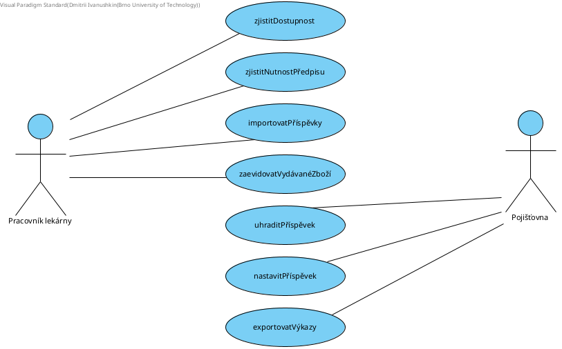

# Pharmacy

## Final version: April 2023

### Description

The pharmacy dispenses medicines to citizens both by prescription and cash. For prescription drugs, part of the price may be covered by the health insurance company. Some medicines are only available by prescription.

The system must enable registration of dispensed drugs, import of drug contributions from health insurance companies (may change from time to time), and also must provide export of reports for health insurance companies, and must be linked to stock (see if the required drug is in stock). Medicines are identified by a name.

### Use-case diagram

### Entity Relationship diagram (Crow's Foot notation)

